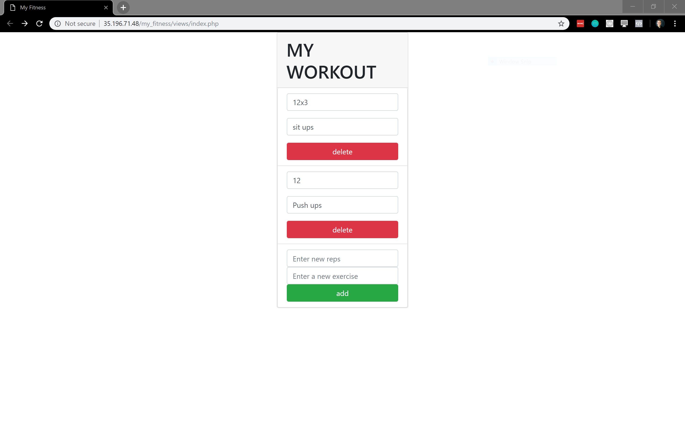
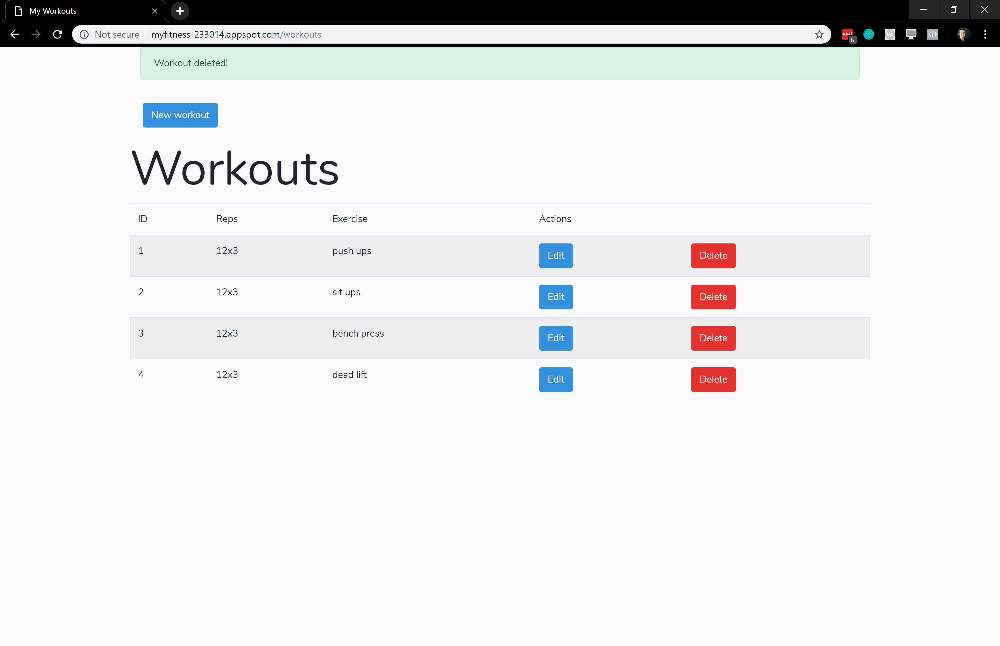

# My simple fitness application.
This is my first real application deployed to google cloud app engine. I made an earlier version of the app, but it was so bad I couldn't leave it like that. 
# Before

 I decided to implement the laravel framework. It's pretty easy to get up and running. By default everything in the application is run from the controller in /public/index.php. I was really impressed with the difference. 
# After

Here is the live version of the application: [myfitness](https://myfitness-233014.appspot.com/workouts)